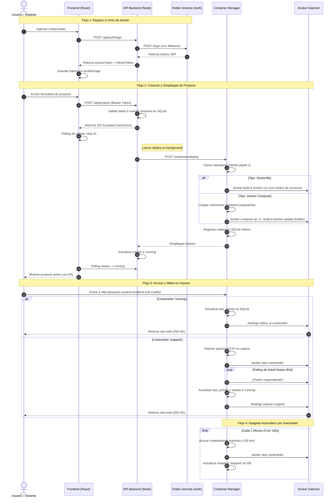

# CubeHost

Plataforma de hosting de páginas web autogestionada basada en contenedores Docker. Permite a los usuarios autenticados mediante el sistema **Roble Uninorte** desplegar sitios web y aplicaciones web (tanto de tipo single-container con `Dockerfile` como multi-container con `Docker Compose`) de manera totalmente automatizada a partir de un repositorio público de GitHub, accesibles a través de subdominios locales dinámicos de dos niveles del tipo `http://nombreProyecto.nombreUsuario.localhost`.

---

## Video de demostración

[](YOUTUBE_URL_PENDIENTE)

> **Nota:** El video muestra el flujo completo de la plataforma en acción: registro e inicio de sesión integrados con la API de Roble, creación y despliegue automatizado de un proyecto desde GitHub, acceso mediante subdominio dinámico local, apagado automático por inactividad tras 30 minutos y el reinicio automático bajo demanda al recibir tráfico web.

---

## Documento Técnico

### 1. Arquitectura y componentes

El sistema sigue una arquitectura modular desacoplada de microservicios orquestados mediante **Docker Compose**. Esto permite separar la lógica de negocio de la orquestación y administración a bajo nivel del daemon de Docker:

```
                      ┌─────────────────────────────────────────┐
                      │          Navegador del Usuario          │
                      └───────────────────┬─────────────────────┘
                                          │ HTTP / WS (Puerto 80)
                                          ▼
                      ┌─────────────────────────────────────────┐
                      │           Caddy Reverse Proxy           │
                      │               (Puerto 80)               │
                      └────┬──────────────────┬──────────────┬──┘
                           │                  │              │
              /api/*       │                  │ /            │ *.*.localhost
      ┌────────────────────┘                  │              └──────────────────────────┐
      ▼                                       ▼                                         ▼
┌──────────────┐                       ┌──────────────┐                         ┌──────────────┐
│  API Backend │                       │   Frontend   │                         │  Proxy HTTP  │
│ (Puerto 4000)│                       │ (Puerto 80)  │                         │ (Puerto 5000)│
└──────┬───────┘                       └──────────────┘                         └──────┬───────┘
       │                                                                               │
       ├─ [SQLite: api_data/cubehost.db]                                                │ Reenvío /
       │                                                                               │ Despertar
       ▼                                                                               ▼
┌──────────────┐                                                                ┌──────────────┐
│  Container   │───────────────────────────────────────────────────────────────►│ Contenedores │
│ Manager API  │         (Orquestación vía Docker Socket / Network)             │  de Usuario  │
│ (Puerto 4001)│                                                                │  (Aislados)  │
└──────┬───────┘                                                                └──────────────┘
       │
   [SQLite: containers_data/containers.db]
```

#### Descripción de Componentes:
*   **Caddy (Reverse Proxy):** Actúa como la puerta de enlace unificada del sistema en el puerto `80`. Recibe todas las peticiones del navegador y realiza el enrutamiento de primer nivel: las peticiones con prefijo `/api/*` se dirigen al servicio `api` (puerto `4000`), el tráfico de navegación al dashboard principal se redirige al `frontend` (puerto `80`), y las peticiones dinámicas de proyectos que sigan el patrón comodín `*.*.localhost` se delegan al proxy HTTP del gestor de contenedores (puerto `5000`).
*   **API Backend (Node.js + Express):** Servicio REST que implementa la lógica de negocio. Administra la base de datos principal de proyectos (`cubehost.db`), las validaciones semánticas de creación y el ciclo de vida del usuario a través de la integración de autenticación centralizada con **Roble Uninorte** vía HTTPS. Coordina las solicitudes complejas enviando llamadas REST internas a la API privada del Container Manager en el puerto `4001`.
*   **Container Manager:** El núcleo de orquestación del sistema. Corre en dos puertos: expone una **API interna (puerto 4001)** para recibir comandos del backend principal y un **Proxy HTTP (puerto 5000)** de cara a Caddy. Tiene montado directamente el socket de Docker del host (`/var/run/docker.sock`) para poder clonar repositorios de Git, compilar imágenes, instanciar contenedores aislados asignándoles red y límites de hardware, apagar contenedores inactivos y despertarlos transparentemente bajo demanda. Mantiene su propio registro temporal en `containers.db` para mapear subdominios.
*   **Frontend (React + Vite + Nginx):** Aplicación web interactiva que ofrece un panel de control intuitivo al estudiante. Facilita el inicio de sesión y registro mediante Roble, creación rápida de proyectos con retroalimentación, visualización de estados en tiempo real y el encendido/apagado/eliminación manual de contenedores. En producción, se compila en estáticos ultraligeros y es servido mediante Nginx en el puerto interno `80`.
*   **Contenedores de Usuario:** Entornos sandbox aislados donde se ejecutan de forma independiente las aplicaciones desplegadas por los alumnos. Se encuentran interconectados en la red interna `cubehost-network` para que el proxy del Container Manager les redirija tráfico web, pero no tienen exposición pública directa ni permisos para comunicarse entre contenedores de otros estudiantes.

#### Tabla de Tecnologías y Puertos:

| Componente | Tecnología | Puerto Interno | Puerto Host | Descripción |
|---|---|---|---|---|
| **Caddy Gateway** | Caddy 2 (Alpine) | `80` | `80:80` | Reverse proxy principal y enrutador unificado |
| **Frontend** | React (Vite) + Nginx | `80` | - (Proxy de Caddy) | Servidor de archivos estáticos del panel de control |
| **API Backend** | Node.js + Express + SQLite | `4000` | - (Proxy de Caddy) | Lógica de negocio y verificación de autenticación Roble |
| **Container Manager (API)** | Node.js + Dockerode | `4001` | - | API interna de orquestación de Docker |
| **Container Manager (Proxy)** | Node.js + http-proxy | `5000` | - (Proxy de Caddy) | Enrutador dinámico de subdominios y wake-on-request |
| **Base de Datos API** | SQLite (`better-sqlite3`) | - | - | Persistencia de proyectos e historial del usuario |
| **Base de Datos Proxy** | SQLite (`better-sqlite3`) | - | - | Estado de contenedores y marcas de tiempo de inactividad |

---

### 2. Flujo de trabajo del sistema

El sistema opera mediante cuatro flujos dinámicos coordinados en segundo plano, representados visualmente en el siguiente diagrama de secuencia:



---

### 3. Estrategia de seguridad y optimización de recursos

#### Seguridad:
*   **Autenticación y autorización centralizada:** La API principal expone un middleware de interceptación (`requireAuth`). Cada request a rutas protegidas valida el token Bearer provisto contactando directamente a la API de Roble. En caso de expiración, se rechaza la petición enviando un `401 Unauthorized` que obliga al Frontend a refrescar las llaves JWT de sesión usando el refresh token almacenado en local.
*   **Aislamiento y privacidad multiusuario:** A nivel de red, cada contenedor desplegado es asignado a la red de aislamiento virtualizada `cubehost-network` usando los namespaces y cgroups provistos por la tecnología nativa de Docker, bloqueando las comunicaciones directas entre proyectos ajenos. A nivel de persistencia de datos, las consultas SQL están fuertemente parametrizadas para asegurar que un usuario solo pueda interactuar con proyectos que contengan su respectivo `roble_user_id`.
*   **Protección contra sobrecargas (Rate Limiting):** Para prevenir ataques de fuerza bruta, DoS y denegación de servicio distribuido (DDoS) se cuenta con dos cortafuegos de velocidad:
    *   **En la API REST principal:** Se limita globalmente a `100 req/min por IP` mediante `express-rate-limit`.
    *   **En el Proxy HTTP de subdominios:** Se limita de forma aislada a `100 req/min por subdominio` para evitar que un proyecto bajo ataque DoS afecte al resto de proyectos de los estudiantes alojados en el mismo servidor de hosting. Al superarse el límite, se responde con un código `429 Too Many Requests`.
*   **Gestión segura de secretos:** No existen claves de APIs, bases de datos o secretos de tokens hardcodeados en el código fuente. Toda la configuración del sistema se inyecta en variables de entorno al momento de arrancar la orquestación en el archivo consolidado `docker-compose.yml`, alimentadas por archivos `.env` locales que permanecen fuera de los repositorios Git.

#### Optimización de recursos:
*   **Restricciones de Hardware por Contenedor:** Para evitar que un bucle infinito o fuga de memoria RAM en el sitio web de un estudiante sature la máquina de hosting de la universidad, el Container Manager impone topes estrictos:
    *   **CPU:** Limitado a `0.5` núcleos mediante `CpuPeriod: 100000` y `CpuQuota: 50000`.
    *   **RAM:** Limitado a un máximo de `256 MB` (`Memory` y `MemorySwap` equivalentes para evitar abusos del disco).
    *   Se configuran globalmente por variables de entorno y se aplican en la instanciación de Dockerfiles y tras la ejecución de proyectos Docker Compose.
*   **Arquitectura pasiva (Apagado por Inactividad):** Los servidores virtuales de alumnos permanecen apagados a menos que tengan tráfico activo. Esta técnica ahorra energía y permite que una máquina host pequeña con pocos recursos de hardware pueda soportar potencialmente a cientos de estudiantes registrados, liberando la RAM cuando estos no están trabajando.
*   **Activación Dinámica bajo Demanda:** El arranque transparente del contenedor al recibir visitas soluciona el dilema de almacenamiento dinámico y asignación de IPs, garantizando un entorno optimizado y escalable en la nube académica.

---

## Requerimientos funcionales

### 1. Autenticación
*   Integración centralizada con la API de Roble Uninorte para registro e inicio de sesión seguro de estudiantes.
*   Espacio de proyectos personal y privado asignado a cada usuario en la base de datos SQLite del sistema.

### 2. Creación de proyectos
El usuario puede crear despliegues suministrando:
1.  Nombre del proyecto (usado para el subdominio local).
2.  URL de su repositorio público de GitHub.
3.  Tipo de contenedor (`Dockerfile` o `Docker Compose`).
4.  Puerto interno que expone su aplicación.

El Container Manager clona el código fuente, compila la imagen e inicia la aplicación de manera automatizada.

### 3. Despliegue y acceso
*   Ejecución en contenedores Docker independientes bajo la red aislada `cubehost-network`.
*   Direccionamiento unificado y accesible en `http://{nombreProyecto}.{nombreUsuario}.localhost` administrado por Caddy.

### 4. Gestión de recursos
*   Protección DoS por subdominio mediante rate limiting.
*   Límites máximos de CPU (`0.5`) y memoria RAM (`256MB`) por contenedor.
*   Apagado automático tras 30 minutos de inactividad de tráfico HTTP.
*   Despertar automático on-demand al entrar a la URL local del proyecto.

---

## Estructura del repositorio

```
CubeHost/
├── frontend/               # React + Vite — Dashboard visual de proyectos
│   ├── src/
│   │   ├── components/     # Modales interactivos (Creación, Borrado)
│   │   ├── context/        # Estado de sesión persistente (AuthContext)
│   │   ├── pages/          # Landing, Login y panel de control (Dashboard)
│   │   └── main.jsx
│   ├── nginx.conf          # Nginx para servir la SPA en producción
│   └── Dockerfile
├── api/                    # Node.js + Express — REST API de proyectos y auth
│   ├── src/
│   │   ├── controllers/    # Controladores REST principales
│   │   ├── db/             # Base de datos local SQLite (cubehost.db)
│   │   ├── middleware/     # Interceptores de CORS y Auth Roble
│   │   ├── services/       # Clientes HTTP externos (Roble, Container Manager)
│   │   └── app.js
│   └── Dockerfile
├── container-manager/      # API y Proxy HTTP de orquestación de Docker
│   ├── src/
│   │   ├── deployer.js     # Clonación y building (Dockerfile y Compose)
│   │   ├── docker.js       # Cliente Dockerode y asignador de recursos
│   │   ├── monitor.js      # Hilo de inactividad programado con node-cron
│   │   ├── proxy.js        # Reenviador de tráfico y despertar on-demand
│   │   └── index.js
│   └── Dockerfile
├── caddy/                  # Servidor proxy inverso Gateway
│   └── Caddyfile
├── docker-compose.yml      # Consolidado de microservicios e infraestructura
└── README.md
```

---

## Requisitos previos

*   Docker Engine >= 24.x
*   Docker Compose >= 2.x
*   Sistema operativo Linux, macOS o Windows (bajo WSL2 habilitado con soporte de Docker Socket `/var/run/docker.sock` [VERIFICAR])
*   Acceso a red local con soporte de resolución comodín de `*.localhost` a `127.0.0.1`.

---

## Instalación y ejecución

1.  Clonar el repositorio:
    ```bash
    git clone <url-del-repo>
    cd CubeHost
    ```

2.  Configurar las variables de entorno principales. Copia el archivo de ejemplo en la raíz de la API:
    ```bash
    cp api/.env.example api/.env
    ```

3.  Edita el archivo `api/.env` agregando el nombre real de tu base de datos de Roble asignada:
    ```env
    PORT=4000
    NODE_ENV=development
    ROBLE_DB_NAME=tu_roble_db_name # Coloca tu base de datos de Roble Uninorte asignada (ej. token_contract_xyz)
    CONTAINER_MANAGER_URL=http://container-manager:4001
    FRONTEND_URL=http://localhost
    DB_PATH=/data/cubehost.db
    ```

4.  Levantar todos los microservicios e infraestructura consolidados en segundo plano:
    ```bash
    docker compose up --build -d
    ```

La plataforma de hosting estará inmediatamente disponible en tu navegador en:
**`http://localhost`**

---

## Equipo

| Nombre | Participación |
|---|---|
| Claudia Elias Sierra | Team Member |
| Carlos Ruidiaz Mendoza | Team Member |
| Juan Fernandez Barrios | Team Member |
| Zenen Contreras Royero | Team Member |

---

## Referencia técnica por componente

Si deseas profundizar en la arquitectura interna y API de cada servicio, puedes consultar sus guías individuales de desarrollo:
*   [Manual de la API REST Backend](./docs/api.md)
*   [Manual del Container Manager e Inactividad](./docs/container-manager.md)
*   [Manual de Configuración del Caddy Proxy](./docs/caddy.md)
*   [Manual de Arquitectura y CSS del Frontend](./docs/frontend.md)
