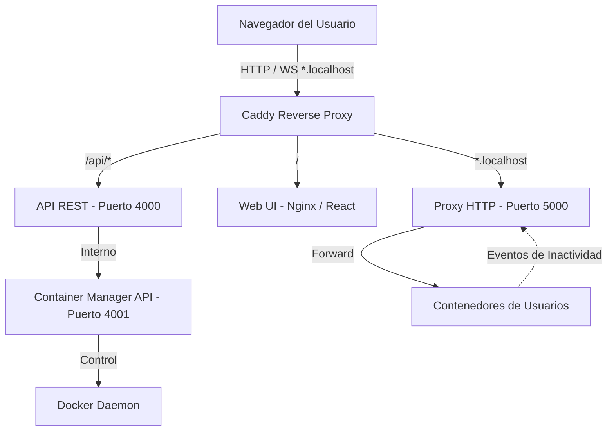

# Documentación Técnica Consolidada — CubeHost

Plataforma de hosting de páginas web autogestionada basada en contenedores Docker. Permite a los usuarios autenticados desplegar sus propios sitios web (tanto single-container con `Dockerfile` como multi-container con `Docker Compose`) de manera automatizada a partir de un repositorio Git.

---

## 1. Arquitectura del Sistema

El sistema se compone de varios servicios distribuidos y orquestados mediante **Docker Compose**:



### Componentes Core:
1. **Caddy (Reverse Proxy)**: Puerta de enlace del sistema en el puerto `80`. Enruta el tráfico hacia el Frontend, la API REST principal y hacia el Proxy de contenedores para los dominios de los usuarios (`*.localhost`).
2. **Frontend (React + Vite)**: Aplicación web de administración. Permite el registro de usuarios, login, creación de proyectos, monitoreo y control manual (encendido/apagado/eliminación) de los contenedores.
3. **API (Node.js + Express)**: Servicio REST principal de la plataforma. Gestiona la lógica de negocio, base de datos local SQLite (`cubehost.db`) para proyectos, y autenticación federada con el servidor central **Roble**.
4. **Container Manager (Node.js + Docker)**:
   - **Servidor API (4001)**: Expone endpoints internos a los que la API REST principal solicita despliegues, detenciones, encendidos y eliminaciones.
   - **Proxy HTTP (5000)**: Enruta dinámicamente las peticiones del subdominio de un usuario a su respectivo contenedor Docker. Cuenta con un sistema de encendido automático al recibir tráfico si el contenedor estaba suspendido.
   - **Monitor de Inactividad**: Tarea periódica (cada minuto) que detiene automáticamente los contenedores sin tráfico web registrado en los últimos 30 minutos.

---

## 2. Modelos de Base de Datos (SQLite)

El sistema emplea dos bases de datos SQLite independientes para desacoplar el estado del negocio de la orquestación de bajo nivel:

### A. Base de Datos de Proyectos (`api/`)
*Archivo: `/data/cubehost.db`*

#### Tabla `projects`
| Columna | Tipo | Descripción |
|---|---|---|
| `id` | INTEGER PK | Identificador único incremental del proyecto |
| `roble_user_id` | TEXT | ID del usuario en el sistema de autenticación Roble (`sub`) |
| `username` | TEXT | Parte local del correo electrónico del usuario |
| `name` | TEXT | Nombre único del proyecto para el usuario |
| `repo_url` | TEXT | URL pública del repositorio de GitHub |
| `container_type` | TEXT | Tipo de despliegue (`dockerfile` o `compose`) |
| `port` | INTEGER | Puerto interno que expone la aplicación del usuario |
| `container_id` | TEXT (NULL) | ID del contenedor Docker generado al desplegar |
| `status` | TEXT | Estado (`pending`, `building`, `running`, `stopped`, `error`) |
| `created_at` | TEXT | Timestamp de creación |
| `updated_at` | TEXT | Timestamp de actualización (trigger automático) |

---

### B. Base de Datos de Orquestación (`container-manager/`)
*Archivo: `/data/containers.db`*

#### Tabla `containers`
| Columna | Tipo | Descripción |
|---|---|---|
| `project_id` | INTEGER PK | Mapeo al ID del proyecto en la base de datos principal |
| `subdomain` | TEXT UNIQUE | Subdominio asignado al proyecto (`nombre-proyecto.usuario`) |
| `container_id` | TEXT | ID del contenedor Docker instanciado |
| `container_name` | TEXT | Nombre asignado en Docker (`cubehost-{project_id}`) |
| `container_type` | TEXT | Tipo de contenedor (`dockerfile` / `compose`) |
| `internal_port` | INTEGER | Puerto interno de reenvío de tráfico |
| `status` | TEXT | Estado de ejecución (`running` o `stopped`) |
| `last_activity` | TEXT | Timestamp de la última petición cursada para auto-apagado |

---

## 3. Flujo de Auto-Apagado por Inactividad y Auto-Despertado

Una de las características clave para la optimización de recursos en CubeHost es el ciclo de vida pasivo de los proyectos:

```
  Tráfico inactivo > 30 min     ┌──────────────────┐
  ─────────────────────────────>│     STOPPED      │
                                └────────┬─────────┘
                                         │
                                         │ Nueva petición HTTP a
                                         │ subdominio.localhost
                                         ▼
  ┌──────────────────┐          ┌──────────────────┐
  │     RUNNING      │<─────────│ Levantando...    │ (Espera hasta 30s)
  └──────────────────┘          └──────────────────┘
```

1. **Auto-Apagado (Inactivity Monitor)**:
   - Una tarea en segundo plano corre cada 1 minuto en `container-manager`.
   - Compara el timestamp `last_activity` de todos los contenedores con estado `running`.
   - Si la diferencia es mayor a `INACTIVITY_TIMEOUT_MS` (por defecto 30 minutos), detiene el contenedor mediante el Docker Daemon y actualiza su estado a `stopped`.
2. **Auto-Despertado (On-Demand Activation)**:
   - Cuando un visitante entra a `http://<proyecto>.<usuario>.localhost`, Caddy pasa la petición al **Proxy HTTP (puerto 5000)**.
   - El Proxy consulta la base de datos de contenedores.
   - Si el contenedor está `stopped`, el proxy retiene la petición HTTP en espera, inicia el contenedor invocando la API de Docker y monitoriza su arranque.
   - En cuanto el puerto del contenedor vuelve a responder (con un timeout máximo de 30 segundos), la petición original es liberada y proxeada al servicio.

---

## 4. Configuración y Despliegue del Sistema

El despliegue de toda la infraestructura requiere Docker y Docker Compose:

### Requisitos Previos:
- Docker Engine >= 20.10
- Docker Compose >= 2.0
- Configuración DNS local (o el archivo `hosts`) mapeando `localhost` y `*.localhost` a `127.0.0.1`.

### Instrucciones de Arranque:
1. Clonar el repositorio.
2. Definir las variables de entorno requeridas en un archivo `.env` en la raíz (especialmente `ROBLE_DB_NAME`).
3. Ejecutar en la raíz del proyecto:
   ```bash
   docker compose up --build -d
   ```
